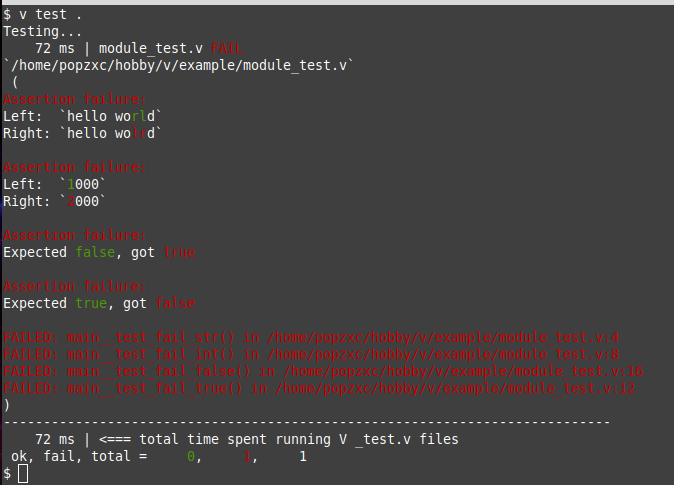

# vtest 0.1.0

Handy unils for writing tests in [V](https://vlang.io/) language.

This lirary provides several `assert_***` functions which enhance the possibilites
of builtin `assert` statement, giving the colored diff of expected and gotten value.



> The version of this module will remain in `0.x.x` unless the language API's are finalized and implemented.

## Examples

```v
import popzxc.vtest

fn test_fail_str() {
    assert vtest.assert_eq_str("hello world", "hello wolrd")
}

fn test_fail_int() {
    assert vtest.assert_eq_int(1000, 2000)
}

fn test_fail_true() {
    assert vtest.assert_true(false)
}

fn test_fail_false() {
    assert vtest.assert_false(true)
}
```

## Installaction

Via vpm:

```sh
v install popzxc.vtest
```

Via vpkg:

```sh
vpkg get https://github.com/popzxc/vtest
```

## Contributing

Feel free to open pull requests!

## License

[MIT](LICENSE)
